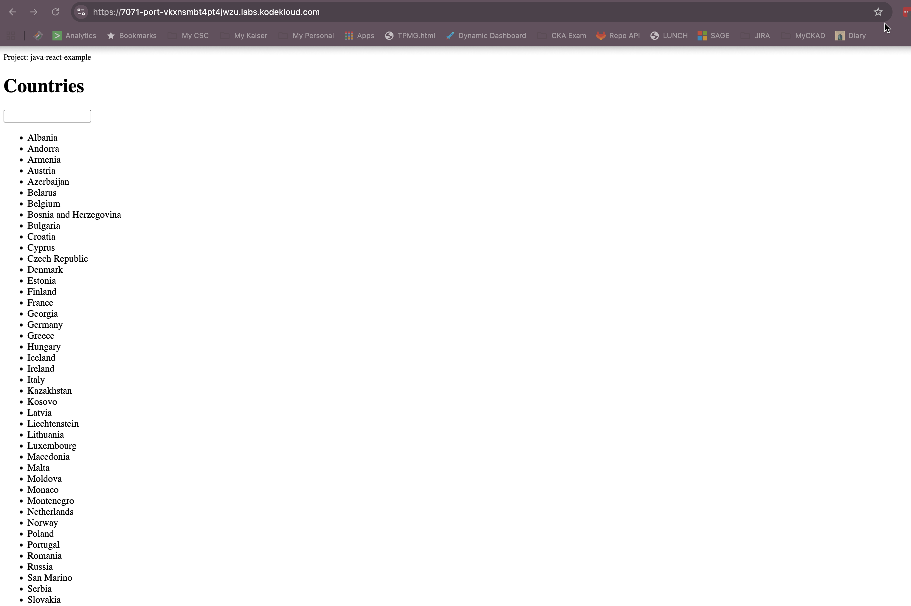

 
## demo Project - Deploying an Application on a Kodekloud Server

Topics of the Demo Project

Create a server and deploy an application on Kodekloud Server. I did not use Digital Ocean.

Technologies Used

Kodekloud Server
Linux
Java
Gradle

## Project Description

Setup and configure a server on Kodekloud Server
Create and configure a new Linux user on the Droplet (Security best practice)
Deploy and run a Java Gradle application on Droplet
Steps to setup and configure a server on Kodekloud Server


## 1. Open KodeKloud Playground

Open:

https://kodekloud.com/playgrounds/

Start an Ubuntu Linux playground/server.

---

# 2. Update System Packages

```bash
sudo apt update
```

---

# 3. Fix Broken Java Installation (if needed) -  This is unique to KodeKloud Server.

If you get an error related to:

```text
/usr/share/man/man1/
```

Run:

```bash
sudo mkdir -p /usr/share/man/man1
sudo dpkg --configure -a
sudo apt --fix-broken install -y
```

---

# 4. Install Java JRE and JDK

Install Java Runtime:

```bash
sudo apt install openjdk-8-jre-headless -y
```

Install Java Development Kit:

```bash
sudo apt install openjdk-8-jdk -y
```

Verify installation:

```bash
java -version
javac -version
```

Expected output:

```text
openjdk version "1.8.0_xxx"
javac 1.8.0_xxx
```

---

# 5. Configure JAVA_HOME

Set JAVA_HOME temporarily:

```bash
export JAVA_HOME=/usr/lib/jvm/java-8-openjdk-amd64
export PATH=$JAVA_HOME/bin:$PATH
```

Verify:

```bash
echo $JAVA_HOME
```

Expected:

```text
/usr/lib/jvm/java-8-openjdk-amd64
```

---

# 6. Install Git

```bash
sudo apt install git -y
```

Verify:

```bash
git --version
```

---

# 7. Clone the Application Repository

Clone project:

```bash
git clone https://github.com/nanuchi/java-react-example.git
```

Move into project folder:

```bash
cd java-react-example
```

---

# 8. Build the Application

Make Gradle executable:

```bash
chmod +x gradlew
```

Build the project:

```bash
./gradlew clean build
```

If successful, you should see:

```text
BUILD SUCCESSFUL
```

---

# 9. Verify JAR File

Check generated JAR:

```bash
ls build/libs
```

Expected:

```text
java-react-example.jar
```

---

# 10. Run the Application

Start application:

```bash
java -jar build/libs/java-react-example.jar
```

Expected output:

```text
Tomcat started on port(s): 7071
```

---

# 11. Access the Application

In KodeKloud playground:

- Open the "Ports" section
- Expose port:

```text
7071
```

Open application in browser:

```text
http://<playground-ip>:7071
```

OR use the generated port-forwarding URL.

---

# 12. Run Application in Background

Stop current process:

```bash
CTRL + C
```

Run in background:

```bash
nohup java -jar build/libs/java-react-example.jar > app.log 2>&1 &
```

---

# 13. Verify Running Process

Check Java process:

```bash
ps aux | grep java
```

Install networking tools:

```bash
sudo apt install net-tools -y
```

Check listening ports:

```bash
netstat -tlnp
```

You should see port:

```text
7071
```

---

# 14. View Application Logs

View logs:

```bash
cat app.log
```

Watch live logs:

```bash
tail -f app.log
```

---

# 15. Create New Linux User

Create user:

```bash
sudo adduser aglinux
```

Follow password prompts.

---

# 16. Add User to sudo Group

```bash
sudo usermod -aG sudo aglinux
```

---

# 17. Switch to New User

```bash
su - aglinux
```

Verify:

```bash
whoami
```

Expected:

```text
fesi
```

---

 

# 18. Stop the Application

Find process ID:

```bash
ps aux | grep java
```

Kill process:

```bash
kill <PID>
```

---

# Complete Command Flow

```bash
sudo apt update

sudo mkdir -p /usr/share/man/man1
sudo dpkg --configure -a
sudo apt --fix-broken install -y

sudo apt install openjdk-8-jre-headless -y
sudo apt install openjdk-8-jdk -y

export JAVA_HOME=/usr/lib/jvm/java-8-openjdk-amd64
export PATH=$JAVA_HOME/bin:$PATH

sudo apt install git -y
sudo apt install net-tools -y

git clone https://github.com/nanuchi/java-react-example.git

cd java-react-example

chmod +x gradlew

./gradlew clean build

java -jar build/libs/java-react-example.jar

nohup java -jar build/libs/java-react-example.jar > app.log 2>&1 &

ps aux | grep java

netstat -tlnp

sudo adduser aglinux

sudo usermod -aG sudo aglinux

su - aglinux
```

## Some outputs for Verifications
```


bob@ubuntu-host ~ ➜  ps aux | grep java
bob         4714  0.0  0.9 10423416 595832 ?     Ssl  20:45   1:24 /usr/lib/jvm/java-8-openjdk-amd64/bin/java -XX:MaxMetaspaceSize=256m -XX:+HeapDumpOnOutOfMemoryError -Xms256m -Xmx512m -Dfile.encoding=UTF-8 -Duser.country=US -Duser.language=en -Duser.variant -cp /home/bob/.gradle/wrapper/dists/gradle-7.4-bin/c0gwcg53nkjbqw7r0h0umtfvt/gradle-7.4/lib/gradle-launcher-7.4.jar org.gradle.launcher.daemon.bootstrap.GradleDaemon 7.4
bob         6984  0.0  0.5 21589912 358012 pts/0 Sl   20:54   0:10 java -jar build/libs/java-react-example.jar
bob         7108  0.0  0.0   6616  2548 pts/2    S+   20:55   0:00 grep --color=auto java

bob@ubuntu-host ~ ➜  sudo apt install net-tools -y
Reading package lists... Done
Building dependency tree       
Reading state information... Done
The following packages will be upgraded:
  net-tools
1 upgraded, 0 newly installed, 0 to remove and 112 not upgraded.
Need to get 192 kB of archives.
After this operation, 8,192 B disk space will be freed.
Get:1 http://archive.ubuntu.com/ubuntu focal-updates/main amd64 net-tools amd64 1.60+git20180626.aebd88e-1ubuntu1.3 [192 kB]
Fetched 192 kB in 0s (1,614 kB/s)
debconf: delaying package configuration, since apt-utils is not installed
(Reading database ... 33979 files and directories currently installed.)
Preparing to unpack .../net-tools_1.60+git20180626.aebd88e-1ubuntu1.3_amd64.deb ...
Unpacking net-tools (1.60+git20180626.aebd88e-1ubuntu1.3) over (1.60+git20180626.aebd88e-1ubuntu1) ...
Setting up net-tools (1.60+git20180626.aebd88e-1ubuntu1.3) ...

bob@ubuntu-host ~ ➜  netstat -tlnp
(Not all processes could be identified, non-owned process info
 will not be shown, you would have to be root to see it all.)
Active Internet connections (only servers)
Proto Recv-Q Send-Q Local Address           Foreign Address         State       PID/Program name    
tcp        0      0 0.0.0.0:22              0.0.0.0:*               LISTEN      -                   
tcp        0      0 0.0.0.0:8080            0.0.0.0:*               LISTEN      -                   
tcp        0      0 127.0.0.53:53           0.0.0.0:*               LISTEN      -                   
tcp6       0      0 :::22                   :::*                    LISTEN      -                   
tcp6       0      0 :::7071                 :::*                    LISTEN      6984/java           
tcp6       0      0 127.0.0.1:35177         :::*                    LISTEN      4714/java           

bob@ubuntu-host ~ ➜  tail -f app.log
tail: cannot open 'app.log' for reading: No such file or directory
tail: no files remaining

bob@ubuntu-host ~ ✖ ls -lrt
total 4
drwxrwxr-x 7 bob bob 4096 May 12 20:54 java-react-example

 

bob@ubuntu-host ~ ✖ sudo adduser aglinux
Adding user `aglinux' ...
Adding new group `aglinux' (1002) ...
Adding new user `aglinux' (1002) with group `aglinux' ...
Creating home directory `/home/aglinux' ...
Copying files from `/etc/skel' ...
New password: 
Retype new password: 
passwd: password updated successfully
Changing the user information for aglinux
Enter the new value, or press ENTER for the default
        Full Name []: ag
        Room Number []: 123
        Work Phone []: 123
        Home Phone []: 
        Other []: 
Is the information correct? [Y/n] y

bob@ubuntu-host ~ ➜  sudo usermod -aG sudo aglinux

bob@ubuntu-host ~ ➜  su - aglinux
Password: 
To run a command as administrator (user "root"), use "sudo <command>".
See "man sudo_root" for details.

aglinux@ubuntu-host:~$ hostname
ubuntu-host
aglinux@ubuntu-host:~$ ipconfig
-bash: ipconfig: command not found
aglinux@ubuntu-host:~$ ifconfig
eth0: flags=4163<UP,BROADCAST,RUNNING,MULTICAST>  mtu 1410
        inet 192.168.208.201  netmask 255.255.255.255  broadcast 0.0.0.0
        inet6 fe80::f474:fff:fe1c:8711  prefixlen 64  scopeid 0x20<link>
        ether f6:74:0f:1c:87:11  txqueuelen 0  (Ethernet)
        RX packets 24830  bytes 358813339 (358.8 MB)
        RX errors 0  dropped 0  overruns 0  frame 0
        TX packets 13994  bytes 1822479 (1.8 MB)
        TX errors 0  dropped 1 overruns 0  carrier 0  collisions 0

lo: flags=73<UP,LOOPBACK,RUNNING>  mtu 65536
        inet 127.0.0.1  netmask 255.0.0.0
        inet6 ::1  prefixlen 128  scopeid 0x10<host>
        loop  txqueuelen 1000  (Local Loopback)
        RX packets 3120  bytes 699780 (699.7 KB)
        RX errors 0  dropped 0  overruns 0  frame 0
        TX packets 3120  bytes 699780 (699.7 KB)
        TX errors 0  dropped 0 overruns 0  carrier 0  collisions 0


```

## Application Deployed

